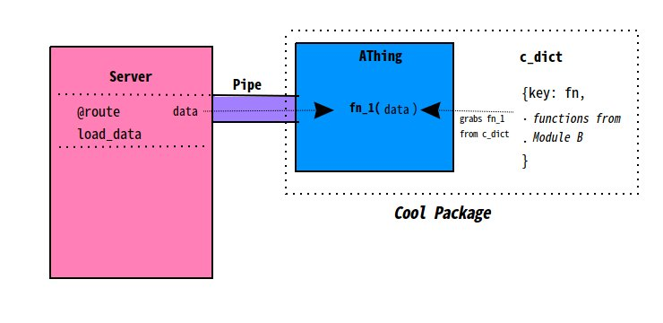

# Cool Package
## Package Overview

### Description
*A brief description of the package’s place in the project and its contents. As each individual module in the package will have its own, more descriptive page, avoid going into too much detail here.*

### Architecture Diagram
*If applicable, a diagram showing how the contents of this package interact, and how they fit into the larger project architecture.*


### Package Contents
- **Module A** - *a module with a class definition*
    - ```class AThing```  - *class defined in module*
- **Module B** - *another module, with a bunch of functions*
    - ```fn_1``` - *a function defined in the module*
    - ```fn_2``` - *another function*
    - ```fn_3``` - *a third function*
- **Module C** - *a module with a big importable dict, of callbacks, rules etc.*
    - ```c_dict``` - *the dict in question*

**Note:** This section is intended to give overview of **what the package contains**, not to describe the functionality of those pieces. Keep to high level of view, **naming importables** without detailing what they do.

##Package Dev History
*A place to casually track of the historical development of the package, following the examples below*

**Date**<br>
Dev name<br>
Branch changes were made on<br>
*Brief, high level description of changes to modules in package (include names, not details about changes in functionality)*

**2/1/17**<br>
Molly<br>
center-core<br>
*Added cool_doer function to module B, added three new items to Module C dict*